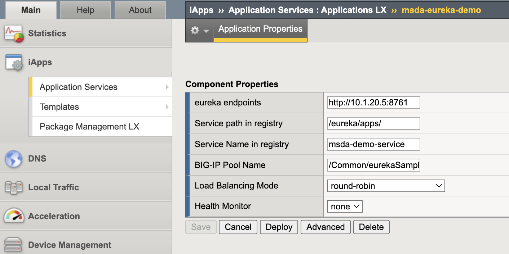
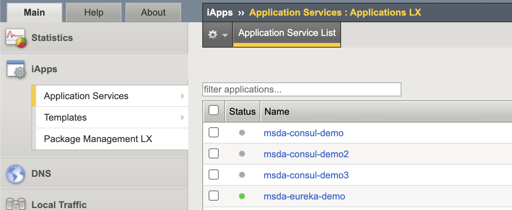

# MSDA-eureka demo

## Prepare springCloud eureka server

If you already have a eureka server, you can skip this step.

`docker pull springcloud/eureka`

run eureka server as a docker container.

`docker run -p 8761:8761 springcloud/eureka -d`

check the container is running.

```bash
root@ubuntu:~/MSDA-Demo/eureka/demoapp# docker ps 
CONTAINER ID   IMAGE                COMMAND                CREATED        STATUS        PORTS                                       NAMES
b2758037afee   springcloud/eureka   "java -jar /app.jar"   23 hours ago   Up 12 hours   0.0.0.0:8761->8761/tcp, :::8761->8761/tcp   competent_kare
root@ubuntu:~/MSDA-Demo/eureka/demoapp# 
root@ubuntu:~/MSDA-Demo/eureka/demoapp#
root@ubuntu:~/MSDA-Demo/eureka/demoapp# 
root@ubuntu:~/MSDA-Demo/eureka/demoapp# curl -s -X GET http://localhost:8761/eureka/apps
<applications>
  <versions__delta>1</versions__delta>
  <apps__hashcode></apps__hashcode>
</applications>root@ubuntu:~/MSDA-Demo/eureka/demoapp# 
root@ubuntu:~/MSDA-Demo/eureka/demoapp# 
ubuntu@k8snode1:~/MSDA-Demo/eureka$ 
ubuntu@k8snode1:~/MSDA-Demo/eureka$ curl -s -H "Accept: application/json" -X GET http://localhost:8761/eureka/apps | jq
{
  "applications": {
    "versions__delta": 1,
    "apps__hashcode": ""
  }
}
ubuntu@k8snode1:~/MSDA-Demo/eureka$ 

```

You can also verify with web browser: <http://localhost:8761/> .

## Prepare application with eureka client

make sure you have node.js installed.

```bash
root@ubuntu:~/MSDA-Demo/eureka/demoapp# node -v 
v16.13.1
root@ubuntu:~/MSDA-Demo/eureka/demoapp# 
```

Install eureka client module.

`npm install eureka-js-client --save`

```bash
oot@ubuntu:~/MSDA-Demo/eureka/demoapp# 
root@ubuntu:~/MSDA-Demo/eureka/demoapp# npm list
demoapp@ /root/MSDA-Demo/eureka/demoapp
└── eureka-js-client@4.5.0

root@ubuntu:~/MSDA-Demo/eureka/demoapp# 
root@ubuntu:~/MSDA-Demo/eureka/demoapp# 
```

Create couple of applications use this template:

```bash
const Eureka = require('eureka-js-client').Eureka;
const eurekaServer = '10.1.10.40';

const eureka = new Eureka({
    instance: {
        app: 'msda-demo-service',
        hostName: 'centos40',
        ipAddr: '10.1.10.40',
        statusPageUrl: 'http://localhost:8080',
        port: {
            '$': 8080,
            '@enabled': 'true',
        },
        vipAddress: 'localhost',
        dataCenterInfo: {
            '@Class': 'com.netflix.appinfo.InstanceInfo$DefaultDataCenterInfo',
        name: 'MyOwn',
        }
    },
    eureka: {
        host: eurekaServer,
        port: 8761, /* Spring Cloud Eureka Registry */
        servicePath: '/eureka/apps/'
    }
});
eureka.logger.level('debug');
eureka.start(function(error){
    console.log(error || 'complete');
});

var timeout = 60 * 1000;
setTimeout(function(){
    console.log('timed out!');
    eureka.stop(function(error){
        console.log(error || 'complete');
    });
},timeout);

```

Make sure to change the IP address of eureka server into your server address.

## Start application client, you will see it registered into eureka server

`node mada-demoapp600.js &`

`node mada-demoapp300.js &`

`node mada-demoapp120.js &`

```bash
ubuntu@k8snode1:~/MSDA-Demo/eureka/demoapp$ 
ubuntu@k8snode1:~/MSDA-Demo/eureka/demoapp$ 
ubuntu@k8snode1:~/MSDA-Demo/eureka/demoapp$ 
ubuntu@k8snode1:~/MSDA-Demo/eureka/demoapp$ node msda-demoapp600.js &
[1] 6739
ubuntu@k8snode1:~/MSDA-Demo/eureka/demoapp$ registered with eureka:  msda-demo-service/centos43
retrieved full registry successfully
complete

ubuntu@k8snode1:~/MSDA-Demo/eureka/demoapp$ node msda-demoapp300.js &
[2] 6755
ubuntu@k8snode1:~/MSDA-Demo/eureka/demoapp$ registered with eureka:  msda-demo-service/centos42
retrieved full registry successfully
complete

ubuntu@k8snode1:~/MSDA-Demo/eureka/demoapp$ 
ubuntu@k8snode1:~/MSDA-Demo/eureka/demoapp$ 
ubuntu@k8snode1:~/MSDA-Demo/eureka/demoapp$ 
ubuntu@k8snode1:~/MSDA-Demo/eureka/demoapp$ node msda-demoapp120.js &
[3] 6766
ubuntu@k8snode1:~/MSDA-Demo/eureka/demoapp$ registered with eureka:  msda-demo-service/msda-demo-service:centos41:10.1.10.41
retrieved full registry successfully
complete

ubuntu@k8snode1:~/MSDA-Demo/eureka/demoapp$ 
ubuntu@k8snode1:~/MSDA-Demo/eureka/demoapp$ 
ubuntu@k8snode1:~/MSDA-Demo/eureka/demoapp$ 
ubuntu@k8snode1:~/MSDA-Demo/eureka/demoapp$ 
ubuntu@k8snode1:~/MSDA-Demo/eureka/demoapp$ curl -s -H "Accept: application/json" -X GET http://localhost:8761/eureka/apps | jq
{
  "applications": {
    "versions__delta": 1,
    "apps__hashcode": "UP_1_",
    "application": {
      "name": "MSDA-DEMO-SERVICE",
      "instance": {
        "hostName": "centos43",
        "app": "MSDA-DEMO-SERVICE",
        "ipAddr": "10.1.10.43",
        "status": "UP",
        "overriddenstatus": "UNKNOWN",
        "port": {
          "@enabled": "true",
          "$": "8080"
        },
        "securePort": {
          "@enabled": "false",
          "$": "7002"
        },
        "countryId": 1,
        "dataCenterInfo": {
          "@class": "com.netflix.appinfo.InstanceInfo$DefaultDataCenterInfo",
          "name": "MyOwn"
        },
        "leaseInfo": {
          "renewalIntervalInSecs": 30,
          "durationInSecs": 90,
          "registrationTimestamp": 1741183285997,
          "lastRenewalTimestamp": 1741183285997,
          "evictionTimestamp": 0,
          "serviceUpTimestamp": 1741183285522
        },
        "metadata": {
          "@class": "java.util.Collections$EmptyMap"
        },
        "statusPageUrl": "http://localhost:8080",
        "vipAddress": "localhost",
        "isCoordinatingDiscoveryServer": false,
        "lastUpdatedTimestamp": 1741183285998,
        "lastDirtyTimestamp": 1741183285519,
        "actionType": "ADDED"
      }
    }
  }
}
ubuntu@k8snode1:~/MSDA-Demo/eureka/demoapp$ 
ubuntu@k8snode1:~/MSDA-Demo/eureka/demoapp$ 
ubuntu@k8snode1:~/MSDA-Demo/eureka/demoapp$ 
ubuntu@k8snode1:~/MSDA-Demo/eureka/demoapp$ retrieved full registry successfully
eureka heartbeat success
eureka heartbeat success
retrieved full registry successfully

ubuntu@k8snode1:~/MSDA-Demo/eureka/demoapp$ 
ubuntu@k8snode1:~/MSDA-Demo/eureka/demoapp$ 
ubuntu@k8snode1:~/MSDA-Demo/eureka/demoapp$ 
ubuntu@k8snode1:~/MSDA-Demo/eureka/demoapp$ curl -s -H "Accept: application/json" -X GET http://localhost:8761/eureka/apps/msda-demo-service | jq
{
  "application": {
    "name": "MSDA-DEMO-SERVICE",
    "instance": [
      {
        "hostName": "centos41",
        "app": "MSDA-DEMO-SERVICE",
        "ipAddr": "10.1.10.41",
        "status": "UP",
        "overriddenstatus": "UNKNOWN",
        "port": {
          "@enabled": "true",
          "$": "8080"
        },
        "securePort": {
          "@enabled": "false",
          "$": "7002"
        },
        "countryId": 1,
        "dataCenterInfo": {
          "@class": "com.netflix.appinfo.InstanceInfo$DefaultDataCenterInfo",
          "name": "MyOwn"
        },
        "leaseInfo": {
          "renewalIntervalInSecs": 30,
          "durationInSecs": 90,
          "registrationTimestamp": 1741183463316,
          "lastRenewalTimestamp": 1741183463316,
          "evictionTimestamp": 0,
          "serviceUpTimestamp": 1741183305311
        },
        "metadata": {
          "@class": "java.util.Collections$EmptyMap"
        },
        "statusPageUrl": "http://localhost:8080",
        "vipAddress": "localhost",
        "isCoordinatingDiscoveryServer": false,
        "lastUpdatedTimestamp": 1741183463316,
        "lastDirtyTimestamp": 1741183463187,
        "actionType": "ADDED"
      },
      {
        "hostName": "centos42",
        "app": "MSDA-DEMO-SERVICE",
        "ipAddr": "10.1.10.42",
        "status": "UP",
        "overriddenstatus": "UNKNOWN",
        "port": {
          "@enabled": "true",
          "$": "8080"
        },
        "securePort": {
          "@enabled": "false",
          "$": "7002"
        },
        "countryId": 1,
        "dataCenterInfo": {
          "@class": "com.netflix.appinfo.InstanceInfo$DefaultDataCenterInfo",
          "name": "MyOwn"
        },
        "leaseInfo": {
          "renewalIntervalInSecs": 30,
          "durationInSecs": 90,
          "registrationTimestamp": 1741183291260,
          "lastRenewalTimestamp": 1741183531390,
          "evictionTimestamp": 0,
          "serviceUpTimestamp": 1741183290822
        },
        "metadata": {
          "@class": "java.util.Collections$EmptyMap"
        },
        "statusPageUrl": "http://localhost:8080",
        "vipAddress": "localhost",
        "isCoordinatingDiscoveryServer": false,
        "lastUpdatedTimestamp": 1741183291260,
        "lastDirtyTimestamp": 1741183290821,
        "actionType": "ADDED"
      },
      {
        "hostName": "centos43",
        "app": "MSDA-DEMO-SERVICE",
        "ipAddr": "10.1.10.43",
        "status": "UP",
        "overriddenstatus": "UNKNOWN",
        "port": {
          "@enabled": "true",
          "$": "8080"
        },
        "securePort": {
          "@enabled": "false",
          "$": "7002"
        },
        "countryId": 1,
        "dataCenterInfo": {
          "@class": "com.netflix.appinfo.InstanceInfo$DefaultDataCenterInfo",
          "name": "MyOwn"
        },
        "leaseInfo": {
          "renewalIntervalInSecs": 30,
          "durationInSecs": 90,
          "registrationTimestamp": 1741183285997,
          "lastRenewalTimestamp": 1741183555899,
          "evictionTimestamp": 0,
          "serviceUpTimestamp": 1741183285522
        },
        "metadata": {
          "@class": "java.util.Collections$EmptyMap"
        },
        "statusPageUrl": "http://localhost:8080",
        "vipAddress": "localhost",
        "isCoordinatingDiscoveryServer": false,
        "lastUpdatedTimestamp": 1741183285998,
        "lastDirtyTimestamp": 1741183285519,
        "actionType": "ADDED"
      }
    ]
  }
}
ubuntu@k8snode1:~/MSDA-Demo/eureka/demoapp$ 
ubuntu@k8snode1:~/MSDA-Demo/eureka/demoapp$ 
ubuntu@k8snode1:~/MSDA-Demo/eureka/demoapp$ 

```

## Install the msda-eureka rpm package into a BIG-IP unit

Follow up the instructions for [MSDA-eureka](https://github.com/ChinaModernAppGroup/msda-eureka) to install the [msda-eureka rpm package](https://github.com/ChinaModernAppGroup/msda-eureka/releases) into a BIG-IP unit, and then try to deploy an application LX with the template.

Goto iApps >> Application Services >> create a new iAppLX application.

For example:



Make sure the Applications LX is deployed successfully.


## Repeat to start the demoapp to register into eureka server

`node msda-demoapp600.js &`

`node mada-demoapp300.js &`

`node mada-demoapp120.js &`

## Verify the pool member configured in the BIG-IP unit

```bash

root@(bigip1)(cfg-sync Standalone)(Active)(/Common)(tmos)# list ltm pool eurekaSamplePool
ltm pool eurekaSamplePool {
    members {
        10.1.10.41:8080 {
            address 10.1.10.41
        }
        10.1.10.42:8080 {
            address 10.1.10.42
        }
        10.1.10.43:8080 {
            address 10.1.10.43
        }
    }
}
root@(bigip1)(cfg-sync Standalone)(Active)(/Common)(tmos)# 
root@(bigip1)(cfg-sync Standalone)(Active)(/Common)(tmos)# 
```

## Wait for a while, then you will see the some member deregistered from the eureka server and the bigip pool also follows the change

```bash

ubuntu@k8snode1:~/MSDA-Demo/eureka/demoapp$ 
ubuntu@k8snode1:~/MSDA-Demo/eureka/demoapp$ curl -s -H "Accept: application/json" -X GET http://localhost:8761/eureka/apps/msda-demo-service | jq
{
  "application": {
    "name": "MSDA-DEMO-SERVICE",
    "instance": {
      "hostName": "centos43",
      "app": "MSDA-DEMO-SERVICE",
      "ipAddr": "10.1.10.43",
      "status": "UP",
      "overriddenstatus": "UNKNOWN",
      "port": {
        "@enabled": "true",
        "$": "8080"
      },
      "securePort": {
        "@enabled": "false",
        "$": "7002"
      },
      "countryId": 1,
      "dataCenterInfo": {
        "@class": "com.netflix.appinfo.InstanceInfo$DefaultDataCenterInfo",
        "name": "MyOwn"
      },
      "leaseInfo": {
        "renewalIntervalInSecs": 30,
        "durationInSecs": 90,
        "registrationTimestamp": 1741184155598,
        "lastRenewalTimestamp": 1741184546234,
        "evictionTimestamp": 0,
        "serviceUpTimestamp": 1741184155541
      },
      "metadata": {
        "@class": "java.util.Collections$EmptyMap"
      },
      "statusPageUrl": "http://localhost:8080",
      "vipAddress": "localhost",
      "isCoordinatingDiscoveryServer": false,
      "lastUpdatedTimestamp": 1741184155598,
      "lastDirtyTimestamp": 1741184155540,
      "actionType": "ADDED"
    }
  }
}
ubuntu@k8snode1:~/MSDA-Demo/eureka/demoapp$ 

# In the bigip

root@(bigip1)(cfg-sync Standalone)(Active)(/Common)(tmos)# 
root@(bigip1)(cfg-sync Standalone)(Active)(/Common)(tmos)# 
root@(bigip1)(cfg-sync Standalone)(Active)(/Common)(tmos)# list ltm pool eurekaSamplePool
ltm pool eurekaSamplePool {
    members {
        10.1.10.43:8080 {
            address 10.1.10.43
        }
    }
}
root@(bigip1)(cfg-sync Standalone)(Active)(/Common)(tmos)# 
```
